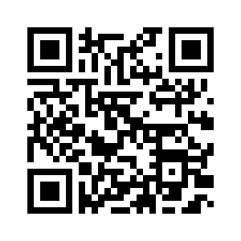

# Projeto Login - Loreine Ewald

Projeto realizado no Curso de <strong>HTML5</strong> e <strong>CSS3</strong> do Curso em Vídeo. 
Com Professor <strong>Gustavo Guanabara</strong>.

--

## 🎯 Objetivo

Este projeto tem como objetivo demonstrar a criação de uma tela de login estilizada, que pode ser usada como base para sistemas maiores ou projetos pessoais. Foi desenvolvido com foco em simplicidade, estética e responsividade.

--

## ✨ Funcionalidades

- Campo de entrada para **usuário** e **senha**
- Link para **recuperação de senha**
- Design **moderno e responsivo**
- Animações sutis para melhor experiência do usuário

--

## 🌐 Acesse o projeto online

🔗 [Acesse aqui o projeto online](https://loreineewald.github.io/projeto-login/)
📦 [Ver repositório no GitHub](https://github.com/Loreineewald/projeto-login)

--

## 📱 Escaneie com seu celular

  

